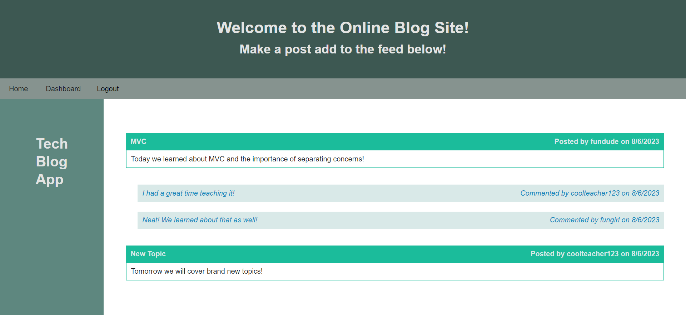

# tech-blog-app

## Description

The Tech Blog app is a platform where developers can create, update, and delete blog posts about various topics in tech. Other developers can see a feed containing all existing posts and can comment on other developer's posts. This creates an environment where fellow developers can interact with and learn from one another! The app was built using server side express module, sequelize ORM for database management, and handlebars templating language to render the different view pages.

## Installation

N/A
## Usage

The Tech blog app opens with a homepage that features any exisitng posts by other developers registered on the site. Before a user can post, comment, update, or delete a post, they must first be registered with the site and will be prompted to do so once any of the aforementioned actions are attempted. Once registered, the user can create, update, and delete their own blog posts as well as comment on other users' post. All posts made by a registered user will be saved on their own personal dashboard and can be reviewed or updated at any time. Time stamps are also used to document when a post has been created.

## Credits

Existing class activities provided a starting point that gave the login/logout functionality and the basis for setting up models and route actions.
Design heavily inspired by the museum (gallery and paintings) excercise provided in class.
Peers were also beneficial by steering me in the right direction to achieve desired goal.

